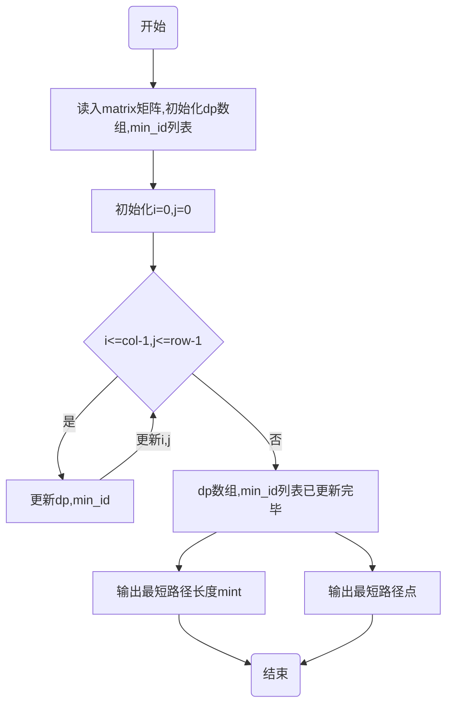

# 高级算法设计与分析作业_03

## 1.问题描述：


## 2.思路分析：

​	根据给出矩阵$$M$$，计算形状， 

``` python
col , row = Matrix.shape 
```

​	初始化全零矩阵$$dp$$，

```python
dp = np.zeros((col,row))
```

​	同时为了输出最短路径，我们可以新设同等形状大小的列表$$min\_id$$，

```python
min_id = [[0 for _ in range(col)] for _ in range(row)]
```

​	在规定了只能向下和向右移动寻找最短路径的情况下，$$dp$$数组转移方程可以定义为比较$$dp[i-1,j]$$和$$ dp[i,j-1]$$的大小. 先更新$$dp$$的第$$0$$行和第$$0$$列边界值,$$dp$$数组更新规则：
$$
\begin{cases}
dp[i,0] = dp[i-1,0] + Matrix[i,0]&   0\le i \le col    \\
dp[0,j] = dp[0,j-1] + Matrix[0,j]&      0\le i \le row   \\
dp[i\,,j] = min(dp[i-1,j]+Matrix[i,j],dp[i,j-1]+Matrix[i,j])&0\le i \le col,\ 0\le i \le row\\
\end{cases}
$$
​	并将每次更新$$dp$$时选取的上一个点$$(i-1,j)或(i,j-1)$$放入$$min\_id[i,j]$$中，在最后输出路径的时候使用while循环输出完整路径：

```python
id = [col-1,row-1]                                      #根据最后的点坐标，从min_id列表中一直查找上一个点坐标直到[0,0]
traj.append([col-1,row-1])
while(id!=[0,0]):										#逐一输出最短路径上的点
         id = min_id[id[0]][id[1]]
         traj.append(id)
traj.reverse()											#转置列表即为正序输出
```

## 3.流程图




## 4.完整代码如下

```python
import numpy as np

def mintraj(matrix):
    col,row = matrix.shape
    dp = np.zeros((col,row))                                #dp数组
    min_id = [[0 for _ in range(col)] for _ in range(row)]  #列表，记录达到本点的最短路径的上一个点
    traj = []                                               #存储最短路径

    # dp updatad
    dp[0,0] = matrix[0,0]                                   #首先更新dp[0,0]
    
    #更新dp[:,0]和dp[0,:]
    for i in range(1,col):                                  
        dp[i,0] = dp[i-1,0] + matrix[i, 0]
        min_id[i][0] = [i-1, 0]                             #记录到达该点的上一个点
    for j in range(1,row):
        dp[0,j] = dp[0,j-1] + matrix[0,j]
        min_id[0][j] = [0, j-1]
    #更新dp[i,j]   
    for i in range(1,col):                                  #由于只能向右，向下移动，对于dp[i,j],只需比较左边和上边的点的大小即可
        for j in range(1,row):
            dp[i,j] = min(dp[i-1,j] + matrix[i,j],
                          dp[i,j-1] + matrix[i,j])  			#更短的路径长度计入dp[i,j]中
            if dp[i-1,j]<=dp[i,j-1]:                        #根据左边和上边的点大小比较，记录下上一个点的坐标
                min_id[i][j] = [i-1,j]
            else:
                min_id[i][j] = [i,j-1]

    mint = dp[col-1,row-1]                                  #最短路径记录在dp[col-1,row-1]中
    id = [col-1,row-1]                                      #根据最后的点坐标，从min_id中一直查找上一个点坐标直到结束
    traj.append([col-1,row-1])
    while(id!=[0,0]):										#逐一输出路径上的点
         id = min_id[id[0]][id[1]]
         traj.append(id)
    traj.reverse()
    return mint,traj										#返回最短路径长度，轨迹

def main():
    matrix = np.random.randint(0,15,(5,5))					#建立随机矩阵matrix
    mint,traj = mintraj(matrix)
    print("最短路径长度：",mint,'\n',
          "最短路径：",traj,'\n',
          "原矩阵",matrix)

if __name__ == '__main__':
    main()
```

## 5.运行结果


​	三个用例输出结果均满足问题描述。
