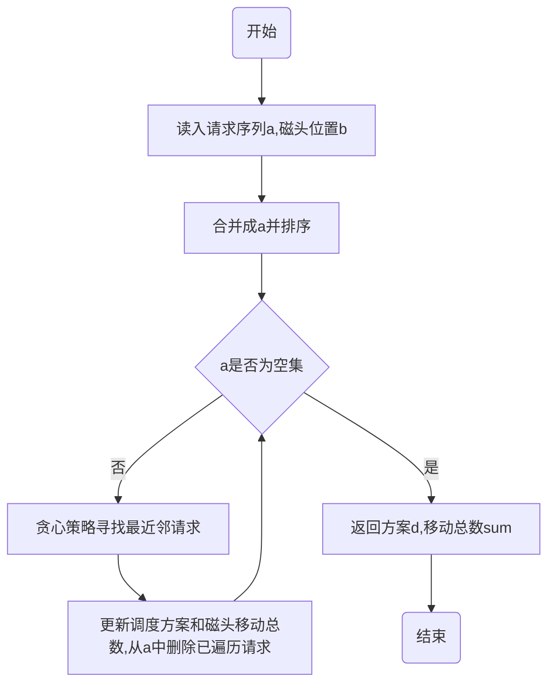

# 高级算法设计与分析作业_04

## 1.问题描述


## 2 .思路分析

​	本题要求基于贪心策略写算法，先对请求序列$$c$$进行排序，并确定磁头 $$b$$ 所在序号 $$b\_index$$ 前后的请求位置，利用贪心策略令磁头 $$b$$每次向 更近距离的请求移动，即移动后为磁头 $$b$$ 新序号 $$b\_newindex$$ ,直至磁头遍历请求序列 $$a$$ 。
$$
b\_newindex&=&argmin{(abs(a[b\_index-1]-b),abs(a[b\_index+1]-b))} \\
move\_distance&=&abs(a[b\_newindex]-b)
$$
​	同时需要考虑边界条件，当磁头 $$b$$ 所在位置为请求序列起点或终点时，此时磁头只能朝一个方向移动，如在起点时只能向后移动，终点时只能向前移动，此时需要设置特殊情况。
$$
\begin{cases}
 b\ move \ backwards \ &b\_index = 0 \\
 b\ move \ forward \ &b\_index = end\\
 \end{cases}
$$


## 3.流程图



## 4.完整代码

```python
def Greed(a,b):                             #a为请求列表，b为磁头初始位置
    a.append(b)                             #将初始位置b加入请求列表a中，并排序
    a.sort()
    d = []                                  #存储调度方案
    d.append(b)
    sum = 0                                 #累计移动总数

    while(a!=[]):                           #当请求非空时
        b_index = a.index(b)                #计算初始位置，用于比较前后序号与b的距离
        n = len(a)                          #计算此时请求序列长度
        if b_index == 0 and n != 1:         #先处理边界情况，如果磁头b在最前面
            d.append(a[b_index + 1])
            sum+= abs(a[b_index + 1] - b)
        elif b_index == 0 and n == 1:
            break
        elif b_index == n - 1 and n != 1:   #如果磁头b在最后面
            d.append(a[b_index - 1])
            sum += abs(a[b_index - 1] - b)
        elif b_index == n - 1 and n == 1:
            break
        else:
            x = abs(b - a[b_index - 1])							#计算磁头与前一个请求的距离
            y = abs(b - a[b_index + 1])							#计算磁头与后一个请求的距离
            index_tmp = b_index - 1 if x<y else b_index + 1		#找出距离磁头更近的请求
            sum += abs(b - a[index_tmp])
            d.append(a[index_tmp])
        a.remove(b)                         #删除
        b = d[-1]                           #磁头位置改变
    return d,sum

d,sum = Greed([98,183,37,122,14,124,65,67],53)
print(d,"\n",sum)
```

##  5.运行结果

### case1

输入: [98,183,37,122,14,124,65,67]      53

输出: [6,5,8,9,11,17,2]   28


### case2

输入: [8,5,9,11,2,17]     6

输出: [6,5,8,9,11,17,2]   28


###  case3

输入: [1,9,5,11,16,18]   6

输出: [8,9,11,16,18,5,1]   27


