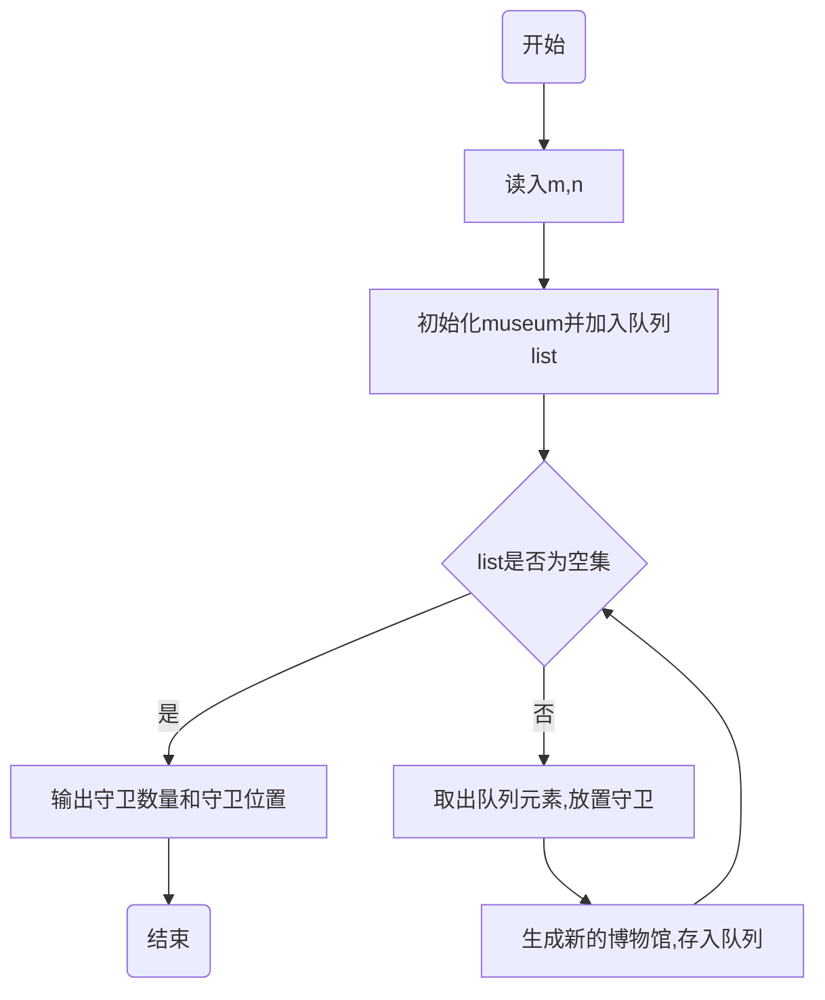

# 高级算法设计与分析作业_05

## 1.问题描述


## 2.思路分析

​	本题要求用分支限界法求解，本题遍历方法是设置一个遍历点$p$，从左到右、从上到下遍历整个博物馆的未被监控的房间，在遍历点$p$的周围放置哨兵守卫。由于遍历顺序是从左往右、从上往下，故只在遍历点$p$的下方、右边和自身的房间放置守卫即可。

​	综上，本题算法构建一个博物馆类，用($m*n$大小的数组)记录守卫$robot$的房间位置，数量和遍历点$p$的位置，使用$setrobot$函数在遍历点下方、右边和自身的位置放置守卫，分别生成新的三个博物馆类，并移动遍历点$p$至未被监督的房间，采用队列的方式存储博物馆类，每次取出队列中一个博物馆类放置机器人，循环至队列为空。在初始化的时候不仅初始化一个博物馆类，并给最小守卫数$minrobots$赋值为：$m*n/2$，每次结果小于最小守卫数的时候才会被采用为结果，并更新$minrobots$，否则剪枝(不存入$list$)。

​	在$setrobot$函数中，移动遍历点$p$至未被监督房间的时候，判断房间是否被监督的方法为查询该房间上下左右自身是否存在守卫，若该房间在边界处时，需特殊处理，在此生成一个$(m+2)*(n+2)$的数组来处理边界情况。

## 3.流程图



## 4 .完整代码

```python
import numpy as np
import copy

class museum_state():                                       #定义博物馆
    def __init__(self,shape):
        self.m,self.n = shape                               #博物馆的大小m，n
        self.robotsroom = np.zeros((self.m,self.n))         #博物馆房间:0:m-1,0:n-1，有守卫时值置为1
        #遍历点坐标，遍历点坐标范围：1:m，1:n
        self.x = 0
        self.y = 0
        self.robotnum = 0                                       #放置的机器人数

def setrobot(oldmuseum,x,y):                #放守卫的函数，x，y为遍历点位置，移动范围：0:m-1，0:n-1
    museum = copy.deepcopy(oldmuseum)       #返回个新的博物馆
    museum.robotnum+=1                      #放的机器人数+1
    museum.robotsroom[x,y] = 1              #机器人位置设为1
    tag = 1                                 #tag为1则被监控
    #放完机器人后，向右移动遍历点至未被监控房间，当博物馆房间都被监控时，遍历点会停在[m,1]
    while(museum.x<= museum.m-1 and tag!=0):
        museum.y+=1
        if(museum.y>museum.n-1):            #说明要换行了
            museum.x += 1
            museum.y = 0
        if(museum.x!=museum.m):
            tag = jugle(museum)             #判断该房间是否被监控
    return museum

#判断遍历点是否被监控,检查自己上中下左右是否有机器人存在
def jugle(museum):
    tag = 0                                 #0未被监控
    positions = [[0, 0],
                 [0,-1],
                 [0, 1],
                 [-1,0],
                 [1, 0],
                 ]
    #处理边界情况太复杂，这里我们新建个临时房间数组：0:m+1,0:n+1，给机器人房间外面围一圈值为0的边界
    temproom = np.zeros([museum.m+2,museum.n+2])
    temproom[1:museum.m+1,1:museum.n+1] = museum.robotsroom
    temp_x = museum.x+1                     #博物馆的位置范围0:m-1对应临时房间数组的1:m
    temp_y = museum.y+1
    #检查上中下左右房间
    for i in range(5):
        pos_x = temp_x+positions[i][0]
        pos_y = temp_y+positions[i][1]
        if(temproom[pos_x,pos_y] == 1):
            tag = 1
    return tag

def juglegoal(museum):                      #判断这个房间是否到终点
    Tag = 0
    if(museum.x==museum.m):
        Tag = 1
    return Tag

def main():
    f = open('input.txt')
    txt = []
    for line in f:
        txt.append(line.strip())
    m = int(txt[0])
    n = int(txt[1])

    minrobots = m*n/2					#最少机器人数
    robotsposition = np.zeros([m,n])    #存机器人摆放方案
    museum = museum_state([m,n])        #初始化一个博物馆并放入队列
    museum_list = []
    museum_list.append(museum)
    
    while(museum_list):
        museum_tmp = museum_list.pop(0)#使用队列，广度优先算法
        # museum_tmp = museum_list.pop()#使用栈，深度优先算法
        goal = juglegoal(museum_tmp)
        if (not goal):#当未遍历到最终点时
            if museum_tmp.x<m-1:#放下面，当x不是最下面那行就可以放下面
                newmuseum = setrobot(museum_tmp,museum_tmp.x+1,museum_tmp.y)
                if newmuseum.robotnum<=minrobots:
                    museum_list.append(newmuseum)
            if museum_tmp.y<n-1:#放右边
                newmuseum = setrobot(museum_tmp,museum_tmp.x,museum_tmp.y+1)
                if newmuseum.robotnum <= minrobots:
                    museum_list.append(newmuseum)
            if (True):#放自己
                newmuseum = setrobot(museum_tmp, museum_tmp.x, museum_tmp.y )
                if newmuseum.robotnum <= minrobots:
                    museum_list.append(newmuseum)

        else:#遍历点到终点了
            # i+=1
            if museum_tmp.robotnum<=minrobots:
                minrobots = museum_tmp.robotnum
                robotsposition = museum_tmp.robotsroom

    with open(r".\output.txt", "w") as op:
        op.write(str(minrobots))
        op.write('\n')
        op.write(str(robotsposition))
        op.close()
    print(minrobots,'\n',robotsposition)

if __name__ == "__main__":
    main()
```


## 5.实验结果

### $m,n=6,6$


### $m,n=7,7$


### $m,n=8,7$

该参数跑了特别久。


